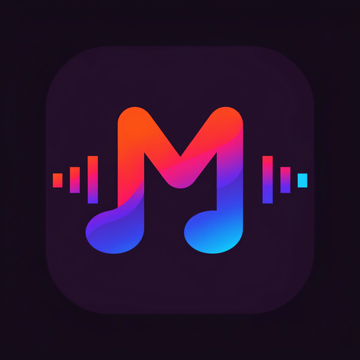

# Melodix

**Feel Every Note.**

A minimal, dark-first Material 3 YouTube Music client for Android with
liquid-glass surfaces, vibrant accents and Spotify personalization.
Based on OpenTune's UI/UX with Meld's Spotify & lossless engine.

> ⚠️ Not affiliated with YouTube, Google LLC, Spotify AB or Qobuz.

## Features
- Ad-free background YouTube Music playback + offline downloads
- Spotify integration: library, search, home, recommendations (no Premium)
- Experimental lossless (FLAC/Hi-Res) with silent fallback
- Liquid-glass navigation/toolbar/mini-player, circular tab indicator
- Synced word-by-word lyrics, romanization, AI translation
- Local files with folder filtering · Listen Together · recognition
- Equalizer, crossfade, sleep timer, alarms, widgets, Android Auto
- Discord RPC · Last.fm scrobbling · Wrapped stats · haptics

## Install & Build
See BUILDING.md. `./gradlew assembleFossDebug` after `git submodule`-free setup
(Listen Together proto sources are vendored).

## Credits
Built on [OpenTune](https://github.com/Arturo254/OpenTune) (UI/UX model, Arturo254),
[Meld](https://github.com/FrancescoGrazioso/Meld) (Spotify/Qobuz engine, Francesco Grazioso),
[Metrolist](https://github.com/MetrolistGroup/Metrolist) (Mo Agamy),
[OuterTune](https://github.com/OuterTune/OuterTune), [InnerTune](https://github.com/z-huang/InnerTune).
Full attribution: NOTICE.md. License: GPL-3.0.
